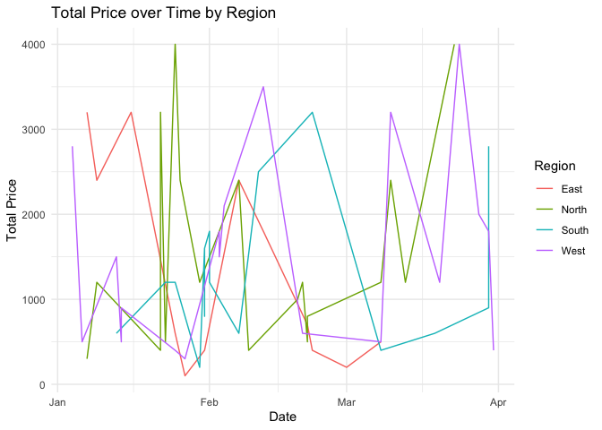
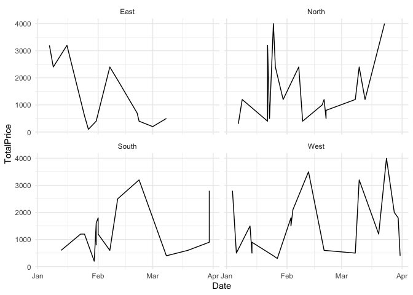

Assignment 1
================
Albert Kaczmarek, h52201551Maciej Kilijański, h12018188Balázs Kiss,
h12314734

-   [Part 1: Data Loading and
    Inspection](#part-1-data-loading-and-inspection)
    -   [1. Load the Data](#1-load-the-data)
    -   [2. Inspect the Data](#2-inspect-the-data)
-   [Part 2: Data Cleaning and
    Tidying](#part-2-data-cleaning-and-tidying)
    -   [3. Handle Missing Values in
        customer_sales](#3-handle-missing-values-in-customer_sales)
    -   [4. Standardize Date Formats](#4-standardize-date-formats)
    -   [5. Correct data types](#5-correct-data-types)
    -   [6. Resolve inconsistencies](#6-resolve-inconsistencies)
-   [Part 3: Data Integration with
    joins](#part-3-data-integration-with-joins)
    -   [7. Left join](#7-left-join)
    -   [8. Inner join](#8-inner-join)
    -   [9. Right join](#9-right-join)
    -   [10. Full Join](#10-full-join)
-   [Part 4: Data Manipulation with
    dplyr](#part-4-data-manipulation-with-dplyr)
    -   [11. Create a Profit and an AgeGroup
        column](#11-create-a-profit-and-an-agegroup-column)
    -   [12. Filter and select data](#12-filter-and-select-data)
    -   [13. Arrange Data](#13-arrange-data)
-   [Part 5: Data Aggregation](#part-5-data-aggregation)
    -   [14. Group and Summarize](#14-group-and-summarize)
    -   [15. Compute cumulative metrics](#15-compute-cumulative-metrics)
-   [Part 6: Data Tidying with tidyr](#part-6-data-tidying-with-tidyr)
    -   [16. Reshape the data](#16-reshape-the-data)
-   [Part 7: Data Visualization with
    ggplot2](#part-7-data-visualization-with-ggplot2)
    -   [17. Create a bar chart](#17-create-a-bar-chart)
    -   [18. Creating a time series
        plot](#18-creating-a-time-series-plot)
    -   [19. Creating a scatterplot](#19-creating-a-scatterplot)
-   [Part 8: Advanced visualization](#part-8-advanced-visualization)
    -   [20. Faceting and Themes](#20-faceting-and-themes)
    -   [21. Customize Scales and
        Guides](#21-customize-scales-and-guides)
-   [Part 9: Additional Analysis with
    Joins](#part-9-additional-analysis-with-joins)
    -   [22. Identify unmatched records](#22-identify-unmatched-records)
    -   [23. Compare Different Joins](#23-compare-different-joins)
-   [Part 10: Deliverables](#part-10-deliverables)
    -   [Data clearning](#data-clearning)
    -   [Joins](#joins)

#### Setup:

Loading necessary libraries.

``` r
library("tidyverse")
library("ggplot2")
library("readr")
library("lubridate")
library("dplyr")
library("ggplot2")
```

## Part 1: Data Loading and Inspection

### 1. Load the Data

``` r
customer_sales <- read_csv("customer_sales.csv")
customer_info <- read_csv("customer_info.csv")
product_info <- read_csv("product_info.csv")
supplier_info <- read_csv("supplier_info.csv")
```

### 2. Inspect the Data

``` r
glimpse(customer_sales)
```

    ## Rows: 80
    ## Columns: 8
    ## $ OrderID    <dbl> 1001, 1002, 1003, 1004, 1005, 1006, 1007, 1008, 1009, 1010,…
    ## $ Date       <chr> "03/02/2023", "10/02/2023", "30/01/2023", "2023-02-19", "02…
    ## $ CustomerID <chr> "C001", "C008", "C008", "C010", "C008", "C018", "C009", "C0…
    ## $ ProductID  <chr> "P114", "P102", "P108", "P106", "P108", "P103", "P101", "P1…
    ## $ Quantity   <dbl> 3, NA, 4, 5, 2, 2, 4, 2, 1, 4, 3, 1, 5, 3, 4, 2, 5, 5, 2, N…
    ## $ UnitPrice  <dbl> 600, 700, 300, 200, 300, 300, 100, -600, 500, -800, 400, 40…
    ## $ TotalPrice <dbl> NA, NA, 1200, 1000, 600, 600, 400, -1200, 500, -3200, 1200,…
    ## $ Region     <chr> "West", "East", "North", "North", "South", "South", "North"…

``` r
summary(customer_sales)
```

    ##     OrderID         Date            CustomerID         ProductID        
    ##  Min.   :1001   Length:80          Length:80          Length:80         
    ##  1st Qu.:1021   Class :character   Class :character   Class :character  
    ##  Median :1040   Mode  :character   Mode  :character   Mode  :character  
    ##  Mean   :1040                                                           
    ##  3rd Qu.:1060                                                           
    ##  Max.   :1080                                                           
    ##                                                                         
    ##     Quantity      UnitPrice      TotalPrice       Region         
    ##  Min.   :1.00   Min.   :-800   Min.   :-3520   Length:80         
    ##  1st Qu.:2.00   1st Qu.: 200   1st Qu.:  500   Class :character  
    ##  Median :3.00   Median : 400   Median : 1200   Mode  :character  
    ##  Mean   :3.08   Mean   : 412   Mean   : 1176                     
    ##  3rd Qu.:4.00   3rd Qu.: 650   3rd Qu.: 2075                     
    ##  Max.   :5.00   Max.   : 800   Max.   : 4000                     
    ##  NA's   :5      NA's   :5      NA's   :14

``` r
glimpse(customer_info)
```

    ## Rows: 20
    ## Columns: 6
    ## $ CustomerID <chr> "C001", "C002", "C003", "C004", "C005", "C006", "C007", "C0…
    ## $ Name       <chr> "Alice Smith", "Bob Johnson", "Charlie Lee", "Diana King", …
    ## $ Email      <chr> "alice@example.com", "bob@example.com", "charlie@example.co…
    ## $ Age        <dbl> 42, 60, 44, 40, 24, 31, 21, 37, 23, 42, 27, 20, 30, 56, 30,…
    ## $ Gender     <chr> "Male", "Male", "Female", "Male", "Male", "Female", "Female…
    ## $ Region     <chr> "West", "West", "North", "South", "East", "South", "South",…

``` r
summary(customer_info)
```

    ##   CustomerID            Name              Email                Age       
    ##  Length:20          Length:20          Length:20          Min.   :20.00  
    ##  Class :character   Class :character   Class :character   1st Qu.:29.25  
    ##  Mode  :character   Mode  :character   Mode  :character   Median :34.00  
    ##                                                           Mean   :36.15  
    ##                                                           3rd Qu.:42.00  
    ##                                                           Max.   :60.00  
    ##     Gender             Region         
    ##  Length:20          Length:20         
    ##  Class :character   Class :character  
    ##  Mode  :character   Mode  :character  
    ##                                       
    ##                                       
    ## 

``` r
glimpse(product_info)
```

    ## Rows: 20
    ## Columns: 4
    ## $ ProductID  <chr> "P101", "P102", "P103", "P104", "P105", "P106", "P107", "P1…
    ## $ Product    <chr> "Laptop", "Chair", "Desk", "Smartphone", "Monitor", "Table"…
    ## $ Category   <chr> "Furniture", "Furniture", "Electronics", "Electronics", "Fu…
    ## $ SupplierID <chr> "S006", "S006", "S003", "S003", "S001", "S001", "S006", "S0…

``` r
summary(product_info)
```

    ##   ProductID           Product            Category          SupplierID       
    ##  Length:20          Length:20          Length:20          Length:20         
    ##  Class :character   Class :character   Class :character   Class :character  
    ##  Mode  :character   Mode  :character   Mode  :character   Mode  :character

``` r
glimpse(supplier_info)
```

    ## Rows: 6
    ## Columns: 4
    ## $ SupplierID   <chr> "S001", "S002", "S003", "S004", "S005", "S006"
    ## $ SupplierName <chr> "TechCorp", "FurniCo", "WoodWorks", "GadgetHub", "HomeEss…
    ## $ ContactEmail <chr> "contact@techcorp.com", "contact@furnico.com", "contact@w…
    ## $ Region       <chr> "North", "South", "West", "East", "East", "North"

``` r
summary(supplier_info)
```

    ##   SupplierID        SupplierName       ContactEmail          Region         
    ##  Length:6           Length:6           Length:6           Length:6          
    ##  Class :character   Class :character   Class :character   Class :character  
    ##  Mode  :character   Mode  :character   Mode  :character   Mode  :character

## Part 2: Data Cleaning and Tidying

### 3. Handle Missing Values in customer_sales

Identify rows with missing Quantity, UnitPrice, or TotalPrice:

``` r
customer_sales |> 
  filter(is.na(Quantity) | is.na(UnitPrice) | is.na(TotalPrice))
```

    ## # A tibble: 15 × 8
    ##    OrderID Date       CustomerID ProductID Quantity UnitPrice TotalPrice Region
    ##      <dbl> <chr>      <chr>      <chr>        <dbl>     <dbl>      <dbl> <chr> 
    ##  1    1001 03/02/2023 C001       P114             3       600         NA West  
    ##  2    1002 10/02/2023 C008       P102            NA       700         NA East  
    ##  3    1012 2023-01-25 C001       P112             1       400         NA West  
    ##  4    1020 27-Jän-23  C020       P116            NA       500         NA West  
    ##  5    1033 28/03/2023 C020       P112             3        NA         NA South 
    ##  6    1036 30-Mär-23  <NA>       P119             1        NA         NA South 
    ##  7    1039 2023-03-01 C003       P115             1        NA         NA East  
    ##  8    1047 2023-02-09 C008       P109            NA       500         NA South 
    ##  9    1062 2023-03-19 C001       P115            NA       600         NA North 
    ## 10    1063 01-07-2023 C002       P116            NA       800         NA East  
    ## 11    1066 14/01/2023 <NA>       P101             1       600         NA West  
    ## 12    1067 2023-03-31 <NA>       P117             3        NA        880 East  
    ## 13    1072 01/02/2023 C012       P105             4       300         NA South 
    ## 14    1078 25-Jän-23  C006       P100             1       400         NA North 
    ## 15    1079 10-Feb-23  C016       P100             5        NA         NA South

Identifying rows with available Quantity, UnitPrice, but no TotalPrice

``` r
customer_sales |> 
  filter(!is.na(Quantity) & !is.na(UnitPrice) & is.na(TotalPrice))
```

    ## # A tibble: 5 × 8
    ##   OrderID Date       CustomerID ProductID Quantity UnitPrice TotalPrice Region
    ##     <dbl> <chr>      <chr>      <chr>        <dbl>     <dbl>      <dbl> <chr> 
    ## 1    1001 03/02/2023 C001       P114             3       600         NA West  
    ## 2    1012 2023-01-25 C001       P112             1       400         NA West  
    ## 3    1066 14/01/2023 <NA>       P101             1       600         NA West  
    ## 4    1072 01/02/2023 C012       P105             4       300         NA South 
    ## 5    1078 25-Jän-23  C006       P100             1       400         NA North

> There are 5 such values

Correcting these values:, using `mutate()`. If `TotalPrice` is missing,
it will be calculated by multiplicating $Quantity\cdot UnitPrice$.

``` r
customer_sales <- customer_sales |> 
  mutate(TotalPrice = ifelse(!is.na(Quantity) & !is.na(UnitPrice & is.na(TotalPrice)), 
                             Quantity * UnitPrice, 
                             TotalPrice))
```

Filtering rows where `Quantity` and `TotalPrice` are available, but
`UnitPrice` is missing:

``` r
customer_sales |> 
  filter(!is.na(Quantity) & is.na(UnitPrice) & !is.na(TotalPrice))
```

    ## # A tibble: 0 × 8
    ## # ℹ 8 variables: OrderID <dbl>, Date <chr>, CustomerID <chr>, ProductID <chr>,
    ## #   Quantity <dbl>, UnitPrice <dbl>, TotalPrice <dbl>, Region <chr>

> There are no such rows

We do not need to fill in missing `UnitPrice`.

Filtering rows where Unit Price and TotalPrice are available, Quantity
is missing:

``` r
customer_sales |> 
  filter(is.na(Quantity) & !is.na(UnitPrice) & !is.na(TotalPrice))
```

    ## # A tibble: 0 × 8
    ## # ℹ 8 variables: OrderID <dbl>, Date <chr>, CustomerID <chr>, ProductID <chr>,
    ## #   Quantity <dbl>, UnitPrice <dbl>, TotalPrice <dbl>, Region <chr>

> There are no such rows

We do not need to fill in missing `Quantity`.

> The rows with remaining NA values in 2 or 3 of the 3 columns are
> removed since their values cannot be inferred:

``` r
customer_sales <- customer_sales |> 
  filter(!(is.na(Quantity) | is.na(UnitPrice) | is.na(TotalPrice)))
```

Only 70 rows are kept from the original 80:

-   10 rows have 2 out of 3 crucial values missing, making them
    impossible to inferr.

### 4. Standardize Date Formats

Substituting values which parse_date_time() doesn’t recognize:

``` r
customer_sales$Date <- gsub("Jän", "Jan", customer_sales$Date)
```

After the values have been cleaned, we can parse the date column:

``` r
customer_sales$Date <- parse_date_time(
  customer_sales$Date,
  orders = c("ymd", "dmy", "mdy", "Ymd", "dmY", "mdY", "dMY"),
  locale = "de_DE" # This helps parse German month abbreviations
)
```

Let’s see the result (`head(,3)` will display 3 top rows):

``` r
head(customer_sales,3)
```

    ## # A tibble: 3 × 8
    ##   OrderID Date                CustomerID ProductID Quantity UnitPrice TotalPrice
    ##     <dbl> <dttm>              <chr>      <chr>        <dbl>     <dbl>      <dbl>
    ## 1    1001 2023-02-03 00:00:00 C001       P114             3       600       1800
    ## 2    1003 2023-01-30 00:00:00 C008       P108             4       300       1200
    ## 3    1004 2023-02-19 00:00:00 C010       P106             5       200       1000
    ## # ℹ 1 more variable: Region <chr>

Correcting the dates which weren’t interpreted for 2023 but should’ve
been e.g. `30-03-23` was parsed as `2030-03-23` instead of `2023-03-30`.
We perform this in several steps:

> Splitting the data frame into 2 - 2023 and non-2023 (wrong) dates 1.
> Filter observations where Date is for 2023 or not available

``` r
df_2023 <- customer_sales |> 
  filter(year(Date) == 2023 | is.na(Date)) |> print()
```

    ## # A tibble: 54 × 8
    ##    OrderID Date                CustomerID ProductID Quantity UnitPrice
    ##      <dbl> <dttm>              <chr>      <chr>        <dbl>     <dbl>
    ##  1    1001 2023-02-03 00:00:00 C001       P114             3       600
    ##  2    1003 2023-01-30 00:00:00 C008       P108             4       300
    ##  3    1004 2023-02-19 00:00:00 C010       P106             5       200
    ##  4    1005 2023-02-07 00:00:00 C008       P108             2       300
    ##  5    1006 2023-01-13 00:00:00 C018       P103             2       300
    ##  6    1007 2023-01-22 00:00:00 C009       P101             4       100
    ##  7    1008 2023-03-08 00:00:00 C007       P111             2      -600
    ##  8    1009 2023-03-08 00:00:00 C007       P108             1       500
    ##  9    1010 2023-01-16 00:00:00 C010       P110             4      -800
    ## 10    1011 2023-03-20 00:00:00 C011       P106             3       400
    ## # ℹ 44 more rows
    ## # ℹ 2 more variables: TotalPrice <dbl>, Region <chr>

2.  Filter observations where Date is NOT for 2023

``` r
df_filtered <- customer_sales |> 
  filter(year(Date) != 2023)  |> print()
```

    ## # A tibble: 16 × 8
    ##    OrderID Date                CustomerID ProductID Quantity UnitPrice
    ##      <dbl> <dttm>              <chr>      <chr>        <dbl>     <dbl>
    ##  1    1021 2031-01-23 00:00:00 C009       P111             2       200
    ##  2    1022 2021-02-23 00:00:00 C009       P102             1       700
    ##  3    1024 2020-02-23 00:00:00 C014       P114             4       300
    ##  4    1025 2030-03-23 00:00:00 C014       P102             3       600
    ##  5    1031 2013-03-23 00:00:00 C007       P107             4       300
    ##  6    1037 2025-01-23 00:00:00 C005       P119             3       200
    ##  7    1038 2022-02-23 00:00:00 C020       P108             4       800
    ##  8    1041 2010-03-23 00:00:00 C001       P106             4      -800
    ##  9    1043 2021-02-23 00:00:00 C004       P116             5       100
    ## 10    1052 2007-01-23 00:00:00 C007       P118             1       300
    ## 11    1054 2013-01-23 00:00:00 C016       P112             3       500
    ## 12    1057 2021-02-23 00:00:00 C008       P115             2       400
    ## 13    1065 2028-03-23 00:00:00 C002       P120             5       400
    ## 14    1069 2031-01-23 00:00:00 C018       P114             2       800
    ## 15    1075 2014-01-23 00:00:00 C006       P118             3       300
    ## 16    1078 2025-01-23 00:00:00 C006       P100             1       400
    ## # ℹ 2 more variables: TotalPrice <dbl>, Region <chr>

3.  Converting dates from YYYY-MM-DD to YY-MM-DD

``` r
df_filtered <- df_filtered |> 
  mutate(Date = format(Date, "%y-%m-%d")) |> print()
```

    ## # A tibble: 16 × 8
    ##    OrderID Date     CustomerID ProductID Quantity UnitPrice TotalPrice Region
    ##      <dbl> <chr>    <chr>      <chr>        <dbl>     <dbl>      <dbl> <chr> 
    ##  1    1021 31-01-23 C009       P111             2       200        400 East  
    ##  2    1022 21-02-23 C009       P102             1       700        700 East  
    ##  3    1024 20-02-23 C014       P114             4       300       1200 North 
    ##  4    1025 30-03-23 C014       P102             3       600       1800 West  
    ##  5    1031 13-03-23 C007       P107             4       300       1200 North 
    ##  6    1037 25-01-23 C005       P119             3       200        600 East  
    ##  7    1038 22-02-23 C020       P108             4       800       3200 South 
    ##  8    1041 10-03-23 C001       P106             4      -800      -3200 West  
    ##  9    1043 21-02-23 C004       P116             5       100        500 North 
    ## 10    1052 07-01-23 C007       P118             1       300        300 North 
    ## 11    1054 13-01-23 C016       P112             3       500       1500 West  
    ## 12    1057 21-02-23 C008       P115             2       400        800 North 
    ## 13    1065 28-03-23 C002       P120             5       400       2000 West  
    ## 14    1069 31-01-23 C018       P114             2       800       1600 South 
    ## 15    1075 14-01-23 C006       P118             3       300        900 West  
    ## 16    1078 25-01-23 C006       P100             1       400        400 North

4.  Converting all non-2023 values to 2023 (Switching YY with DD)

``` r
df_filtered <- df_filtered |> 
  mutate(Date = dmy(Date)) |> print()
```

    ## # A tibble: 16 × 8
    ##    OrderID Date       CustomerID ProductID Quantity UnitPrice TotalPrice Region
    ##      <dbl> <date>     <chr>      <chr>        <dbl>     <dbl>      <dbl> <chr> 
    ##  1    1021 2023-01-31 C009       P111             2       200        400 East  
    ##  2    1022 2023-02-21 C009       P102             1       700        700 East  
    ##  3    1024 2023-02-20 C014       P114             4       300       1200 North 
    ##  4    1025 2023-03-30 C014       P102             3       600       1800 West  
    ##  5    1031 2023-03-13 C007       P107             4       300       1200 North 
    ##  6    1037 2023-01-25 C005       P119             3       200        600 East  
    ##  7    1038 2023-02-22 C020       P108             4       800       3200 South 
    ##  8    1041 2023-03-10 C001       P106             4      -800      -3200 West  
    ##  9    1043 2023-02-21 C004       P116             5       100        500 North 
    ## 10    1052 2023-01-07 C007       P118             1       300        300 North 
    ## 11    1054 2023-01-13 C016       P112             3       500       1500 West  
    ## 12    1057 2023-02-21 C008       P115             2       400        800 North 
    ## 13    1065 2023-03-28 C002       P120             5       400       2000 West  
    ## 14    1069 2023-01-31 C018       P114             2       800       1600 South 
    ## 15    1075 2023-01-14 C006       P118             3       300        900 West  
    ## 16    1078 2023-01-25 C006       P100             1       400        400 North

5.  Converting them back to standard format (YYYY-MM-DD)
6.  Combining the 2 data frames back together

``` r
customer_sales <- bind_rows(df_2023, df_filtered) |> print()
```

    ## # A tibble: 70 × 8
    ##    OrderID Date                CustomerID ProductID Quantity UnitPrice
    ##      <dbl> <dttm>              <chr>      <chr>        <dbl>     <dbl>
    ##  1    1001 2023-02-03 00:00:00 C001       P114             3       600
    ##  2    1003 2023-01-30 00:00:00 C008       P108             4       300
    ##  3    1004 2023-02-19 00:00:00 C010       P106             5       200
    ##  4    1005 2023-02-07 00:00:00 C008       P108             2       300
    ##  5    1006 2023-01-13 00:00:00 C018       P103             2       300
    ##  6    1007 2023-01-22 00:00:00 C009       P101             4       100
    ##  7    1008 2023-03-08 00:00:00 C007       P111             2      -600
    ##  8    1009 2023-03-08 00:00:00 C007       P108             1       500
    ##  9    1010 2023-01-16 00:00:00 C010       P110             4      -800
    ## 10    1011 2023-03-20 00:00:00 C011       P106             3       400
    ## # ℹ 60 more rows
    ## # ℹ 2 more variables: TotalPrice <dbl>, Region <chr>

7.  Checking if all dates are for 2023

``` r
customer_sales |>
  filter(year(Date) != 2023)
```

    ## # A tibble: 0 × 8
    ## # ℹ 8 variables: OrderID <dbl>, Date <dttm>, CustomerID <chr>, ProductID <chr>,
    ## #   Quantity <dbl>, UnitPrice <dbl>, TotalPrice <dbl>, Region <chr>

As we can see, the returned tibble is empty, meaning all dates are
correct. We can remove the 2 separate parts as we don’t need them
anymore

``` r
rm(df_2023, df_filtered)
```

### 5. Correct data types

Converting OrderID, Quantity, UnitPrice and TotalPrice columns from dbl
to integer.

``` r
customer_sales$OrderID <- as.integer(customer_sales$OrderID)
customer_sales$Date <- as.Date(customer_sales$Date)
customer_sales$Quantity <- as.integer(customer_sales$Quantity)
customer_sales$UnitPrice <- as.integer(customer_sales$UnitPrice)
customer_sales$TotalPrice <- as.integer(customer_sales$TotalPrice)
```

Let’s see the result:

``` r
head(customer_sales,3)
```

    ## # A tibble: 3 × 8
    ##   OrderID Date       CustomerID ProductID Quantity UnitPrice TotalPrice Region
    ##     <int> <date>     <chr>      <chr>        <int>     <int>      <int> <chr> 
    ## 1    1001 2023-02-03 C001       P114             3       600       1800 West  
    ## 2    1003 2023-01-30 C008       P108             4       300       1200 North 
    ## 3    1004 2023-02-19 C010       P106             5       200       1000 North

All formats are correct

### 6. Resolve inconsistencies

Correct any discrepancies found + Correcting negative values

``` r
customer_sales$UnitPrice <- abs(customer_sales$UnitPrice)
customer_sales$TotalPrice <- abs(customer_sales$TotalPrice)
```

Verify that TotalPrice equals $Quantity \cdot UnitPrice$ for all rows

``` r
all(customer_sales$TotalPrice == customer_sales$Quantity * customer_sales$UnitPrice)
```

    ## [1] TRUE

> All values correspond with each other

## Part 3: Data Integration with joins

### 7. Left join

Perform a `left_join()` of `customer_sales` with `customer_info` on
`CustomerID`

``` r
customer_sales_enriched <- left_join(customer_sales, customer_info, by = "CustomerID")
```

Identify how many rows have missing customer information after the join

``` r
customer_sales_enriched |> filter(is.na(Name))
```

    ## # A tibble: 3 × 13
    ##   OrderID Date       CustomerID ProductID Quantity UnitPrice TotalPrice Region.x
    ##     <int> <date>     <chr>      <chr>        <int>     <int>      <int> <chr>   
    ## 1    1035 2023-01-23 <NA>       P105             2       600       1200 South   
    ## 2    1048 2023-02-20 <NA>       P110             2       300        600 West    
    ## 3    1066 2023-01-14 <NA>       P101             1       600        600 West    
    ## # ℹ 5 more variables: Name <chr>, Email <chr>, Age <dbl>, Gender <chr>,
    ## #   Region.y <chr>

> There are 3 observations with missing customer information

### 8. Inner join

Perform a `inner_join()` of `customer_sales_enriched` with
`product_info` on `ProductID`

``` r
customer_sales_enriched <- inner_join(
  customer_sales_enriched, product_info, by = "ProductID"
  )
```

Determine the number of rows in the resulting dataset

``` r
glimpse(customer_sales_enriched)
```

    ## Rows: 67
    ## Columns: 16
    ## $ OrderID    <int> 1001, 1003, 1004, 1005, 1006, 1007, 1008, 1009, 1010, 1011,…
    ## $ Date       <date> 2023-02-03, 2023-01-30, 2023-02-19, 2023-02-07, 2023-01-13…
    ## $ CustomerID <chr> "C001", "C008", "C010", "C008", "C018", "C009", "C007", "C0…
    ## $ ProductID  <chr> "P114", "P108", "P106", "P108", "P103", "P101", "P111", "P1…
    ## $ Quantity   <int> 3, 4, 5, 2, 2, 4, 2, 1, 4, 3, 1, 5, 3, 2, 5, 5, 2, 3, 3, 3,…
    ## $ UnitPrice  <int> 600, 300, 200, 300, 300, 100, 600, 500, 800, 400, 400, 500,…
    ## $ TotalPrice <int> 1800, 1200, 1000, 600, 600, 400, 1200, 500, 3200, 1200, 400…
    ## $ Region.x   <chr> "West", "North", "North", "South", "South", "North", "North…
    ## $ Name       <chr> "Alice Smith", "Hannah Scott", "Jane Baker", "Hannah Scott"…
    ## $ Email      <chr> "alice@example.com", "hannah@example.com", "jane@example.co…
    ## $ Age        <dbl> 42, 37, 42, 37, 34, 23, 21, 21, 42, 27, 42, 34, 42, 27, 27,…
    ## $ Gender     <chr> "Male", "Female", "Male", "Female", "Male", "Male", "Female…
    ## $ Region.y   <chr> "West", "West", "East", "West", "West", "South", "South", "…
    ## $ Product    <chr> "Router", "Bookshelf", "Table", "Bookshelf", "Desk", "Lapto…
    ## $ Category   <chr> "Furniture", "Furniture", "Electronics", "Furniture", "Elec…
    ## $ SupplierID <chr> "S003", "S005", "S001", "S005", "S003", "S006", "S001", "S0…

> 67 rows instead of 70 in the previous dataset

### 9. Right join

Perform a `right_join()` of `product_info` with `customer_sales` on
`ProductID`

``` r
product_info_enriched <- right_join(product_info, customer_sales, by = "ProductID")
```

Identify products that have no sales records

``` r
product_info_enriched |> 
  filter(is.na(OrderID))
```

    ## # A tibble: 0 × 11
    ## # ℹ 11 variables: ProductID <chr>, Product <chr>, Category <chr>,
    ## #   SupplierID <chr>, OrderID <int>, Date <date>, CustomerID <chr>,
    ## #   Quantity <int>, UnitPrice <int>, TotalPrice <int>, Region <chr>

> There is no such product

### 10. Full Join

Perform a `full_join()` of `customer_info` with `customer_sales` on
`CustomerID`

``` r
customer_info_enriched <- full_join(customer_info, customer_sales, by = "CustomerID")
```

Identify customers who have not made any purchases

``` r
customer_info_enriched |> 
  filter(is.na(OrderID))
```

    ## # A tibble: 1 × 13
    ##   CustomerID Name       Email   Age Gender Region.x OrderID Date   ProductID
    ##   <chr>      <chr>      <chr> <dbl> <chr>  <chr>      <int> <date> <chr>    
    ## 1 C015       Oscar Jon… osca…    30 Male   South         NA NA     <NA>     
    ## # ℹ 4 more variables: Quantity <int>, UnitPrice <int>, TotalPrice <int>,
    ## #   Region.y <chr>

> 1 customer hasn’t made any purchases: Oscar Jones

## Part 4: Data Manipulation with dplyr

### 11. Create a Profit and an AgeGroup column

``` r
customer_sales_enriched <- customer_sales_enriched |> 
  mutate(Profit = TotalPrice * 0.25,
         AgeGroup = case_when(
           Age < 30 ~ "Under 30",
           Age >= 30 & Age <= 40 ~ "30-40",
           Age > 40 ~ "Over 40"
         ))
```

### 12. Filter and select data

Assuming we want to get info about the customer region, not the sales
region, we will use `Region.y`

``` r
customer_sales_enriched |> 
  filter(Category == "Electronics") |> 
  select(OrderID,
         Date,
         CustomerID,
         Name,
         Product,
         Quantity,
         UnitPrice,
         TotalPrice,
         Profit,
         Region.y,
         AgeGroup)
```

    ## # A tibble: 29 × 11
    ##    OrderID Date       CustomerID Name      Product Quantity UnitPrice TotalPrice
    ##      <int> <date>     <chr>      <chr>     <chr>      <int>     <int>      <int>
    ##  1    1004 2023-02-19 C010       Jane Bak… Table          5       200       1000
    ##  2    1006 2023-01-13 C018       Rachel N… Desk           2       300        600
    ##  3    1010 2023-01-16 C010       Jane Bak… Printer        4       800       3200
    ##  4    1011 2023-03-20 C011       Kevin Ca… Table          3       400       1200
    ##  5    1012 2023-01-25 C001       Alice Sm… Speaker        1       400        400
    ##  6    1013 2023-02-11 C019       Steve Pa… Smartp…        5       500       2500
    ##  7    1014 2023-02-04 C010       Jane Bak… Printer        3       700       2100
    ##  8    1023 2023-03-30 C005       Ethan Br… Sofa           3       300        900
    ##  9    1027 2023-02-01 C001       Alice Sm… Sofa           3       600       1800
    ## 10    1028 2023-01-22 C010       Jane Bak… Lamp           4       800       3200
    ## # ℹ 19 more rows
    ## # ℹ 3 more variables: Profit <dbl>, Region.y <chr>, AgeGroup <chr>

### 13. Arrange Data

Arranging descending by `TotalPrice`:

``` r
customer_sales_enriched |>
  arrange(desc(TotalPrice))
```

    ## # A tibble: 67 × 18
    ##    OrderID Date       CustomerID ProductID Quantity UnitPrice TotalPrice
    ##      <int> <date>     <chr>      <chr>        <int>     <int>      <int>
    ##  1    1017 2023-03-23 C011       P111             5       800       4000
    ##  2    1046 2023-01-25 C005       P118             5       800       4000
    ##  3    1058 2023-03-24 C007       P104             5       800       4000
    ##  4    1049 2023-02-12 C018       P116             5       700       3500
    ##  5    1010 2023-01-16 C010       P110             4       800       3200
    ##  6    1028 2023-01-22 C010       P116             4       800       3200
    ##  7    1051 2023-01-07 C006       P101             4       800       3200
    ##  8    1038 2023-02-22 C020       P108             4       800       3200
    ##  9    1041 2023-03-10 C001       P106             4       800       3200
    ## 10    1045 2023-01-04 C001       P107             4       700       2800
    ## # ℹ 57 more rows
    ## # ℹ 11 more variables: Region.x <chr>, Name <chr>, Email <chr>, Age <dbl>,
    ## #   Gender <chr>, Region.y <chr>, Product <chr>, Category <chr>,
    ## #   SupplierID <chr>, Profit <dbl>, AgeGroup <chr>

## Part 5: Data Aggregation

### 14. Group and Summarize

Grouping by `Region.x` (sales region) and `Category`. Then creating a
summary of `TotalQuantity`, `TotalPrice` and `AverageProfit`.

``` r
customer_sales_enriched |> 
  group_by(Region.x, Category) |>
  summarise(TotalQuantity = sum(Quantity),
            TotalPrice = sum(TotalPrice),
            AverageProfit = mean(Profit), .groups = 'keep') |>
            arrange(Region.x, Category)
```

    ## # A tibble: 8 × 5
    ## # Groups:   Region.x, Category [8]
    ##   Region.x Category    TotalQuantity TotalPrice AverageProfit
    ##   <chr>    <chr>               <int>      <int>         <dbl>
    ## 1 East     Electronics            16       8400          420 
    ## 2 East     Furniture              17       7500          268.
    ## 3 North    Electronics            28       8800          314.
    ## 4 North    Furniture              38      19500          443.
    ## 5 South    Electronics            22       8400          300 
    ## 6 South    Furniture              32      14800          370 
    ## 7 West     Electronics            28      17500          438.
    ## 8 West     Furniture              28      12600          315

### 15. Compute cumulative metrics

Computing `TotalPrice` per `Region.x`, arranged descending by `Region.x`

``` r
customer_sales_enriched |> 
  group_by(Region.x) |> 
  summarise(TotalPrice = sum(TotalPrice)) |>
  arrange(desc(Region.x))
```

    ## # A tibble: 4 × 2
    ##   Region.x TotalPrice
    ##   <chr>         <int>
    ## 1 West          30100
    ## 2 South         23200
    ## 3 North         28300
    ## 4 East          15900

## Part 6: Data Tidying with tidyr

### 16. Reshape the data

Creating a wide-format table showing TotalPrice for each Product across
different Regions

``` r
wide <- customer_sales_enriched |>
  group_by(ProductID, Region.x) |>
  summarise(TotalPrice = sum(TotalPrice)) |>
  pivot_wider(names_from = Region.x, values_from = TotalPrice)
```

    ## `summarise()` has grouped output by 'ProductID'. You can override using the
    ## `.groups` argument.

``` r
wide
```

    ## # A tibble: 20 × 5
    ## # Groups:   ProductID [20]
    ##    ProductID  East North South  West
    ##    <chr>     <int> <int> <int> <int>
    ##  1 P101       3200   400  2000   600
    ##  2 P102        700    NA  2800  1800
    ##  3 P103        400    NA   600    NA
    ##  4 P104         NA    NA  2500  4000
    ##  5 P105         NA    NA  3600    NA
    ##  6 P106         NA  1000    NA  4400
    ##  7 P107         NA  1200   200  2800
    ##  8 P108         NA  1200  3800   500
    ##  9 P109       2400   500  2200    NA
    ## 10 P110       3200    NA    NA  2700
    ## 11 P111        400 10000    NA  1500
    ## 12 P112       1800    NA    NA  1900
    ## 13 P113         NA    NA   800    NA
    ## 14 P114        100  1200  1600  1800
    ## 15 P115         NA  3600    NA    NA
    ## 16 P116         NA  3700    NA  3500
    ## 17 P117         NA    NA  2700  1000
    ## 18 P118       2900  4300    NA  1600
    ## 19 P119        600    NA   400    NA
    ## 20 P120        200  1200    NA  2000

> New columns called afrer `Region.x` values. Less rows.

Converting it back to long format

``` r
long <- wide |> 
  pivot_longer(
    cols = c("East", "North", "South", "West"),
    names_to = 'Region',
    values_to = 'TotalPrice'
  ) |> 
  filter(!is.na(TotalPrice))
long
```

    ## # A tibble: 48 × 3
    ## # Groups:   ProductID [20]
    ##    ProductID Region TotalPrice
    ##    <chr>     <chr>       <int>
    ##  1 P101      East         3200
    ##  2 P101      North         400
    ##  3 P101      South        2000
    ##  4 P101      West          600
    ##  5 P102      East          700
    ##  6 P102      South        2800
    ##  7 P102      West         1800
    ##  8 P103      East          400
    ##  9 P103      South         600
    ## 10 P104      South        2500
    ## # ℹ 38 more rows

> Less columns, back to 48 rows

## Part 7: Data Visualization with ggplot2

### 17. Create a bar chart

Plotting total price for each category on bar chart

``` r
customer_sales_enriched |> 
  group_by(Category) |> 
  summarise(TotalPrice = sum(TotalPrice)) |> 
  ggplot(mapping = aes(x = Category)) + 
    geom_bar(aes(weight = TotalPrice))
```

<!-- -->

### 18. Creating a time series plot

``` r
customer_sales_enriched |> 
  ggplot(mapping = aes(x = Date, y = TotalPrice, color = Region.x)) +
  geom_line() +
  labs(x = "Date", y = "Total Price", color = "Region", title = "Total Price over Time by Region") +
  theme_minimal()
```

<!-- -->

### 19. Creating a scatterplot

``` r
customer_sales_enriched |> 
  ggplot(mapping = aes(x = UnitPrice, y = Quantity, size = Profit)) +
  geom_point(alpha = 0.6, color = "lightblue") +  # Use alpha to make points semi-transparent for better visibility
  facet_wrap(~ Category) +   # Facet by Category
  labs(x = "Unit Price", y = "Quantity", size = "Profit", title = "Unit Price vs. Quantity by Category") +
  theme_minimal()
```

<!-- -->

## Part 8: Advanced visualization

### 20. Faceting and Themes

Using `facet_wrap()` to create separate plots for each Region.

Applying a custom theme to enhance visual appeal.

``` r
customer_sales_enriched |> 
  ggplot(mapping = aes(x = Date, y = TotalPrice)) +
  geom_line() +
  facet_wrap(~ Region.x) +
  theme_minimal()
```

<!-- -->

### 21. Customize Scales and Guides

Customizing color scales and legends, using the `color` parameter.

Adding informative axis labels and a descriptive title using `labs()`.

``` r
customer_sales_enriched |> 
  ggplot(mapping = aes(x = Date, y = TotalPrice, color = Category)) +
  geom_line() +
  facet_wrap(~ Region.x) +
  labs(x = "Date", y = "Total Price", color = "Category", title = "Total Price over Time by Category for each Region") +
  theme_minimal()
```

<!-- -->

## Part 9: Additional Analysis with Joins

### 22. Identify unmatched records

After joins, identify any `OrderID` s without matching `CustomerID` s or
`ProductID` s.

To do so, we use `filter()` with two conditions and `OR` statement
between.

``` r
customer_sales_enriched |> 
  filter(is.na(CustomerID) | is.na(ProductID))
```

    ## # A tibble: 3 × 18
    ##   OrderID Date       CustomerID ProductID Quantity UnitPrice TotalPrice Region.x
    ##     <int> <date>     <chr>      <chr>        <int>     <int>      <int> <chr>   
    ## 1    1035 2023-01-23 <NA>       P105             2       600       1200 South   
    ## 2    1048 2023-02-20 <NA>       P110             2       300        600 West    
    ## 3    1066 2023-01-14 <NA>       P101             1       600        600 West    
    ## # ℹ 10 more variables: Name <chr>, Email <chr>, Age <dbl>, Gender <chr>,
    ## #   Region.y <chr>, Product <chr>, Category <chr>, SupplierID <chr>,
    ## #   Profit <dbl>, AgeGroup <chr>

> There are 3 rows with missing `CustomerID`

1.  Possible reasons for missing `CustomerID`:
    1.  Failure to capture customer information upon sale
    2.  Customer purchasing online without registering a personal
        account
    3.  Data handling mistakes, wrong / missing data entry
2.  Potential implications:
    1.  Missing information on customers - less information to base
        decisions on
    2.  Not being able do identify loyal customers - missing opportunity
        to reward / incentivize
    3.  Losing the capability of personalizing and targeting promotions
        to the individual customer

### 23. Compare Different Joins

Join customer_sales and customer_info using:

1.  `left_join`

``` r
left <- left_join(customer_sales, customer_info, by = 'CustomerID')
```

2.  `inner_join`

``` r
inner <- inner_join(customer_sales, customer_info, by = 'CustomerID')
```

3.  `right_join`

``` r
right <- right_join(customer_sales, customer_info, by = 'CustomerID')
```

4.  `full_join`

``` r
full <- full_join(customer_sales, customer_info, by = 'CustomerID')
```

Now, lets compare the number of rows received:

``` r
nrow(left)
```

    ## [1] 70

``` r
nrow(inner)
```

    ## [1] 67

``` r
nrow(right)
```

    ## [1] 68

``` r
nrow(full)
```

    ## [1] 71

Differences between joins. When is each join type appropriate:

| Join type | Method of working                                                                                                        | When appropriate?                                                                                              |
|-----------|--------------------------------------------------------------------------------------------------------------------------|----------------------------------------------------------------------------------------------------------------|
| Left      | Takes the available values in the left data frame and looks for matching values in the right                             | Appropriate when we want to take the left’s values as a basis and look up matching values for it               |
| Inner     | Only takes values from the 2 data frames where there are matching pairs                                                  | Appropriate when we only want the intersection of the 2 data frames                                            |
| Right     | The inverse of left: it takes the available values in the right data frame and looks for matching values in the left     | Appropriate when we want to take the right’s values as a basis and look up matching values for it in the left  |
| Full      | Joins the 2 data frames regardless of matching pairs. The resulting data frame includes all of the 2 data frame’s values | Appropriate when we want to combine the values from 2 tables without leaving out any of the values in the join |

## Part 10: Deliverables

### Data clearning

Our data clearing process started with importing necessary libraries to
`R`. These included `dplyr`, `tidyverse`, `lubridate` and `readr`.

Then, data was imported from csv files using the `read_csv` command.

Upon inspecting data, we realized the size of it and necessary steps to
perform. 1. First, we handled the missing values in `customer_sales` csv
file. We filtered the tibble using the `filter()` command, to only see
rows with either `Quantity`, `UnitPrice` or `TotalPrice` missing. We
then went on and inferred the missing values, if only just a single
column was missing. There were 10 cases in which we had to remove a row,
because we could not inferr values - two or more columns were missing
data. 2. We then progressed to standardizing date formats in the same
file. During step 1, we’ve notised there are some cases when January is
written as `Jän` (Austrian), not the German `Jan`. These were replaced
by using the `gsub()` command. After these have beencleaned, we had to
correct some dates, which were incorrectly parsed, due to using
`YY-MM-DD` format. Some dates were from 2030! The `mutate()` command was
very handy here. 3. We then fixed data types from `dbl` into `integer`
or `date` using `as.integer()` and `as.Date()` commands. 4. Next, we
integrated all csv files using joins. More about it in the ### Analysis
& Key findings

### Joins
