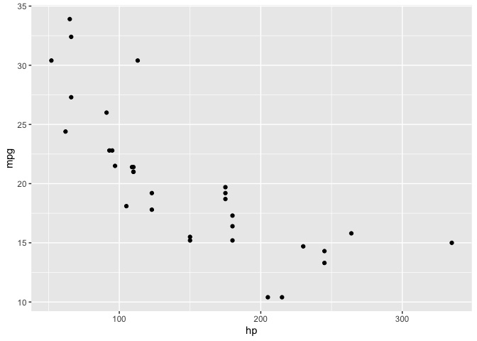

Unit 3 - Tidyverse
================
Maciej Kilijański

Slides [here](./unit_3_tidyverse.pdf)

# CRISP-DM data science workflow

> Cross-industry standard process for data mining (CRISP-DM)

## Sample workflow

1.  Business understanding - what is the business problem/need?
2.  Data understanding - What data do we have vs. need? What are our
    sources? How is data structured? Where is is stored?
3.  Data preparation
4.  Modeling - What modeling techniques should we use?
    -   What’s the granularity of forecast?
    -   What are we predicting (*probability/sales volumes/etc* -
        format)
    -   What are we judging the model on? *Accuracy of the forecast*
5.  Evaluation - Which model best meets the business objectives?
6.  Deployment - How do stakeholders access the results?

# Tidyverse

> A collection of `R` packages

-   Consistent Syntax and philosophy

During the subjects following packages will be used:

-   **dplyr** - Data Manipulation
-   **tydyR** - Daty Cleaning (Tidying)
-   **ggplot2** - Visualization

> Code written using Tidyverse is more **readeable** and
> **reproducible**

``` r
library(tidyverse)
```

## Differences in syntax

### Pipes `%>%`

Pipes allow for composing a sequence of function calls in a more
readeable way. Look at the following:

Standard R syntax:

``` standard
print(head(iris))
```

Pipes syntax

``` pipes
iris %>% head() %>% print()
```

## Excercise

Sample data

``` r
data('mtcars')
```

### Data manipulation with dplyr

#### `filter()` Cars with more than 20 miles per gallon and 6 cylinders

Standard `R`

``` r
mtcars_filtered <- mtcars[mtcars[,1] >= 20 & mtcars[,2] == 6,]
mtcars_filtered
```

    ##                 mpg cyl disp  hp drat    wt  qsec vs am gear carb
    ## Mazda RX4      21.0   6  160 110 3.90 2.620 16.46  0  1    4    4
    ## Mazda RX4 Wag  21.0   6  160 110 3.90 2.875 17.02  0  1    4    4
    ## Hornet 4 Drive 21.4   6  258 110 3.08 3.215 19.44  1  0    3    1

`R` with `dplyr`

``` r
mtcars_filtered <- mtcars %>% filter(mpg > 20) %>% filter (cyl == 6)
mtcars_filtered
```

    ##                 mpg cyl disp  hp drat    wt  qsec vs am gear carb
    ## Mazda RX4      21.0   6  160 110 3.90 2.620 16.46  0  1    4    4
    ## Mazda RX4 Wag  21.0   6  160 110 3.90 2.875 17.02  0  1    4    4
    ## Hornet 4 Drive 21.4   6  258 110 3.08 3.215 19.44  1  0    3    1

#### `select()` columns by names or conditions (`head(10)` = 10 top rows)

``` r
mtcars %>% select(mpg, cyl, hp) %>% head(10)
```

    ##                    mpg cyl  hp
    ## Mazda RX4         21.0   6 110
    ## Mazda RX4 Wag     21.0   6 110
    ## Datsun 710        22.8   4  93
    ## Hornet 4 Drive    21.4   6 110
    ## Hornet Sportabout 18.7   8 175
    ## Valiant           18.1   6 105
    ## Duster 360        14.3   8 245
    ## Merc 240D         24.4   4  62
    ## Merc 230          22.8   4  95
    ## Merc 280          19.2   6 123

#### Calculate horse power to cylinder ratio

``` r
mtcars_mutated <- mtcars %>% mutate(hp_per_cyl = hp / cyl) %>% 
select (hp, cyl, hp_per_cyl) %>% head(10)
mtcars_mutated
```

    ##                    hp cyl hp_per_cyl
    ## Mazda RX4         110   6   18.33333
    ## Mazda RX4 Wag     110   6   18.33333
    ## Datsun 710         93   4   23.25000
    ## Hornet 4 Drive    110   6   18.33333
    ## Hornet Sportabout 175   8   21.87500
    ## Valiant           105   6   17.50000
    ## Duster 360        245   8   30.62500
    ## Merc 240D          62   4   15.50000
    ## Merc 230           95   4   23.75000
    ## Merc 280          123   6   20.50000

#### `arrange()` sort rows by columns

``` r
mtcars %>% arrange(desc(mpg)) %>% head(10) %>% print()
```

    ##                 mpg cyl  disp  hp drat    wt  qsec vs am gear carb
    ## Toyota Corolla 33.9   4  71.1  65 4.22 1.835 19.90  1  1    4    1
    ## Fiat 128       32.4   4  78.7  66 4.08 2.200 19.47  1  1    4    1
    ## Honda Civic    30.4   4  75.7  52 4.93 1.615 18.52  1  1    4    2
    ## Lotus Europa   30.4   4  95.1 113 3.77 1.513 16.90  1  1    5    2
    ## Fiat X1-9      27.3   4  79.0  66 4.08 1.935 18.90  1  1    4    1
    ## Porsche 914-2  26.0   4 120.3  91 4.43 2.140 16.70  0  1    5    2
    ## Merc 240D      24.4   4 146.7  62 3.69 3.190 20.00  1  0    4    2
    ## Datsun 710     22.8   4 108.0  93 3.85 2.320 18.61  1  1    4    1
    ## Merc 230       22.8   4 140.8  95 3.92 3.150 22.90  1  0    4    2
    ## Toyota Corona  21.5   4 120.1  97 3.70 2.465 20.01  1  0    3    1

#### `summarize()` and `group_by()`

``` r
mtcars %>% group_by(cyl) %>% 
summarize(mean_mpg = mean(mpg), count = n()) %>% print()
```

    ## # A tibble: 3 × 3
    ##     cyl mean_mpg count
    ##   <dbl>    <dbl> <int>
    ## 1     4     26.7    11
    ## 2     6     19.7     7
    ## 3     8     15.1    14

### Data Tidying with tidyR

Example messy data

``` r
messy_data <- tibble(
  id = 1:4,
  treatment_a = c(3, 4, 6, 8),
  treatment_b = c(5, 6, 7, 9)
)
messy_data
```

    ## # A tibble: 4 × 3
    ##      id treatment_a treatment_b
    ##   <int>       <dbl>       <dbl>
    ## 1     1           3           5
    ## 2     2           4           6
    ## 3     3           6           7
    ## 4     4           8           9

#### `gather()`: Convert wide data to long format

``` r
tidy_data <- messy_data %>% gather(key = "treatment", value = "response", treatment_a:treatment_b)
tidy_data
```

    ## # A tibble: 8 × 3
    ##      id treatment   response
    ##   <int> <chr>          <dbl>
    ## 1     1 treatment_a        3
    ## 2     2 treatment_a        4
    ## 3     3 treatment_a        6
    ## 4     4 treatment_a        8
    ## 5     1 treatment_b        5
    ## 6     2 treatment_b        6
    ## 7     3 treatment_b        7
    ## 8     4 treatment_b        9

#### `spread()`: Convert long data to wide format

``` r
wide_data <- tidy_data %>% spread(key = treatment, value = response)
wide_data
```

    ## # A tibble: 4 × 3
    ##      id treatment_a treatment_b
    ##   <int>       <dbl>       <dbl>
    ## 1     1           3           5
    ## 2     2           4           6
    ## 3     3           6           7
    ## 4     4           8           9

#### `separate()`: Split a single column into multiple columns

``` r
separated_data <- tidy_data %>% separate(treatment, into = c("treatment", "type"), sep = "_")
separated_data
```

    ## # A tibble: 8 × 4
    ##      id treatment type  response
    ##   <int> <chr>     <chr>    <dbl>
    ## 1     1 treatment a            3
    ## 2     2 treatment a            4
    ## 3     3 treatment a            6
    ## 4     4 treatment a            8
    ## 5     1 treatment b            5
    ## 6     2 treatment b            6
    ## 7     3 treatment b            7
    ## 8     4 treatment b            9

#### `unite()`: Combine multiple columns into one

``` r
united_data <- separated_data %>% unite(treatment_type, treatment, type, sep = "_")
united_data
```

    ## # A tibble: 8 × 3
    ##      id treatment_type response
    ##   <int> <chr>             <dbl>
    ## 1     1 treatment_a           3
    ## 2     2 treatment_a           4
    ## 3     3 treatment_a           6
    ## 4     4 treatment_a           8
    ## 5     1 treatment_b           5
    ## 6     2 treatment_b           6
    ## 7     3 treatment_b           7
    ## 8     4 treatment_b           9

### Advanced dplyr Techniques

#### Joins: `left_join()`, `inner_join()`, `right_join()`, `full_join()`

``` r
df1 <- tibble(id = 1:3, value1 = c("A", "B", "C"))
df1 %>% print()
```

    ## # A tibble: 3 × 2
    ##      id value1
    ##   <int> <chr> 
    ## 1     1 A     
    ## 2     2 B     
    ## 3     3 C

``` r
df2 <- tibble(id = 2:4, value2 = c("D", "E", "F"))
df2 %>% print()
```

    ## # A tibble: 3 × 2
    ##      id value2
    ##   <int> <chr> 
    ## 1     2 D     
    ## 2     3 E     
    ## 3     4 F

Includes all values from df1 (left table), excludes all not-matched rows
of df2 (right table)

``` r
left_join(df1, df2, by = "id")
```

    ## # A tibble: 3 × 3
    ##      id value1 value2
    ##   <int> <chr>  <chr> 
    ## 1     1 A      <NA>  
    ## 2     2 B      D     
    ## 3     3 C      E

Includes only rows with matching keys in both joined tables

``` r
inner_join(df1, df2, by = "id")
```

    ## # A tibble: 2 × 3
    ##      id value1 value2
    ##   <int> <chr>  <chr> 
    ## 1     2 B      D     
    ## 2     3 C      E

Includes all values from df2 (righ table), excludes all not-matched rows
of df1 (left table)

``` r
right_join(df1, df2, by = "id")
```

    ## # A tibble: 3 × 3
    ##      id value1 value2
    ##   <int> <chr>  <chr> 
    ## 1     2 B      D     
    ## 2     3 C      E     
    ## 3     4 <NA>   F

Includes all values

``` r
full_join(df1, df2, by = "id")
```

    ## # A tibble: 4 × 3
    ##      id value1 value2
    ##   <int> <chr>  <chr> 
    ## 1     1 A      <NA>  
    ## 2     2 B      D     
    ## 3     3 C      E     
    ## 4     4 <NA>   F

#### Window functions: `lead()`, `lag()`, `cumsum()`, etc.

``` r
mtcars %>% mutate(lag_mpg = lag(mpg), cumsum_mpg = cumsum(mpg)) %>%
select(mpg, lag_mpg, cumsum_mpg) %>% head(10)
```

    ##                    mpg lag_mpg cumsum_mpg
    ## Mazda RX4         21.0      NA       21.0
    ## Mazda RX4 Wag     21.0    21.0       42.0
    ## Datsun 710        22.8    21.0       64.8
    ## Hornet 4 Drive    21.4    22.8       86.2
    ## Hornet Sportabout 18.7    21.4      104.9
    ## Valiant           18.1    18.7      123.0
    ## Duster 360        14.3    18.1      137.3
    ## Merc 240D         24.4    14.3      161.7
    ## Merc 230          22.8    24.4      184.5
    ## Merc 280          19.2    22.8      203.7

### `ggplot2`

``` r
library(ggplot2)
```

#### Defining data for plot

``` r
ggplot(data = mtcars)
```

<!-- -->

#### Mapping points on the plot

``` r
ggplot(mtcars, mapping = aes(x = hp, y = mpg))
```

<!-- -->

#### Creating a scatterplot

``` r
ggplot(mtcars, mapping = aes(x = hp, y = mpg)) +
  geom_point()
```

<!-- -->

#### Adding fit and trendline overlay + title and axis names

``` r
ggplot(mtcars, mapping = aes(x = hp, y = mpg)) +
  # to create a scatterplot
  geom_point() +
  # to fit and overlay a trendline
  geom_smooth(formula = y ~ x, method = "lm") +
  # to add a title and name the axes
  labs(title = "Scatter plot of MPG vs HP", x = "HP", y = "Miles per Gallon")
```

<!-- -->

#### Adding another mapping - cylinders depicted by colors

``` r
ggplot(mtcars, mapping = aes(x = hp, y = mpg, color = factor(cyl))) +
  geom_point() +
  scale_colour_viridis_d()
```

<!-- -->

#### Colors are hard to distinguish, changing them to manual scale

``` r
ggplot(mtcars, aes(x = wt, y = mpg, color = factor(cyl))) +
  geom_point(size = 3) +
  scale_color_manual(values = c("red", "green", "blue")) +
  theme_classic()
```

<!-- -->

#### Faceting: facet_wrap(), facet_grid()

Need to show the relationship divided by sub-groups. Example: cylinders.

``` r
ggplot(mtcars, aes(x = wt, y = mpg)) +
  geom_point() +
  facet_wrap(~ cyl)
```

<!-- -->

``` r
ggplot(mtcars, aes(x = wt, y = mpg)) +
  geom_point() +
  facet_grid(vs ~ am)
```

<!-- -->
